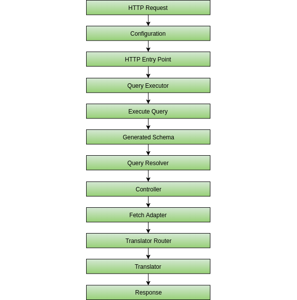
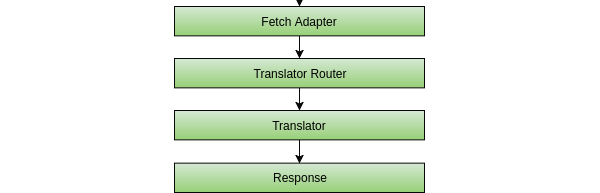

# Principles & Architecture

This framework is built to be as **simple** as possible to use, preferring a **convenience-over-configuration** approach. Although it is aimed to be entirely modular, using its core built-in features will provide a much better experience.

## Workflow

When working with the library, you should follow this workflow:

1. Create a GraphQL schema to expose.
2. Create a GraphQL entry point.
3. Create a Controller for each type in the GraphQL schema.
4. Test your API.

See [Getting Started](getting-started.md) for a better starting example.

## Architecture

Here is the flow of a query in the framework, cut piece-by-piece.

We have received a GraphQL request from a client. The `GraphQLConfiguration` object is built and used throughout the entire framework.

The HTTP entry point the takes the configuration and begin executing the query as any other by passing the arguments and query text to the `QueryExecutor`, which acts as the core object of the framework.

The `QueryExecutor` executes the query on the auto-generated schema. The Generated Schema then reaches the Query Resolver, which is used to determine the correct controller and controller function to execute.

Once the correct controller is determined, its resolve function is executed.

The Fetch Adapter is used by the controller to get a specific query result.

The Fetch Adapter communicates with a translator to convert the given entities to their target GraphQL DTO correctly.

Finally, the result is returned to the client.
